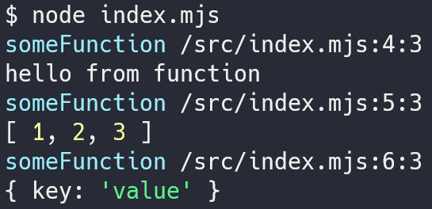

# log-passport

`console.log` with called function name and source location

## Usage

```bash
npm i tksi/log-passport
```

### Sample

```javascript
import log from 'log-passport';

const someFunction = () => {
  log('hello from function');
  log([1, 2, 3]);
  log({ key: 'value' });
};

someFunction();
```



## Note

- Not compatible with CommonJS
- source location may be incorrect in some cases (depends on `Error.prototype.stack`)
